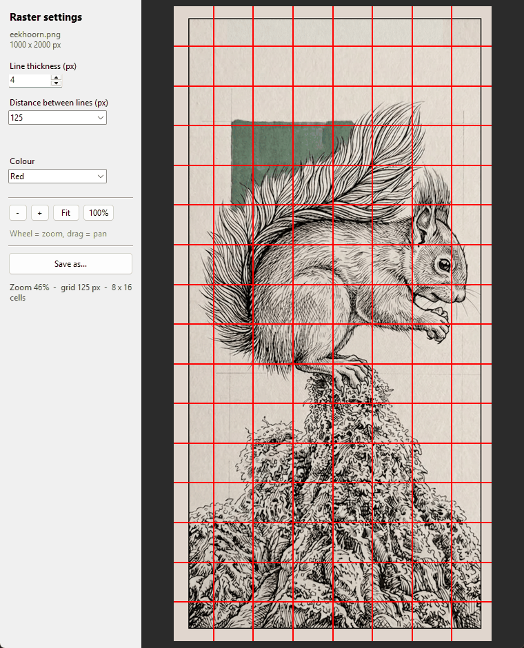

# Art Helper

A small desktop tool for preparing a drawing. It has two modes, switched with
the buttons in the top left:

- **Grid mode** draws a reference grid onto a photo, so you can sketch
  difficult subjects square by square instead of building the grid by hand in
  an image editor.
- **Compose mode** plans a new picture: you set the final frame size, drop a
  photo into it, block areas out with hollow rectangles and circles, and move
  and scale everything until the composition works.



*A 125 px raster (8 x 16 cells) over a 1000 x 2000 px drawing, 4 px lines.*

## Grid mode

- Pick any `.png` / `.jpg` / `.jpeg` / `.bmp` / `.tif` / `.webp`; the file
  dialog opens in the folder the script sits in, where the photos live.
- Adjustable line thickness (default 2 px) and colour (default red).
- Grid spacing suggestions computed from the image size. Every suggestion
  divides both edges exactly, so there are no half cells at the border — e.g.
  `250 px (4 x 8)` for a 1000 x 2000 photo. You can still type any spacing you
  like; the status line then tells you the edge cells are partial.
- **Refine cell**: tick the box, pick 2x / 4x / 8x, then click a cell to split
  it further — useful for hands and faces. Clicking the same cell with the same
  factor removes it again, and **Reset refinements** clears all of them.
  Dragging still pans, so only a click without movement picks a cell.
- Live preview with mouse-wheel zoom (anchored at the cursor) and drag to pan.
- Saves a copy in the original format, with the save dialog opening in the
  folder the photo came from.

## Compose mode

- Choose the final frame size from the presets — 2000 x 2000, 4000 x 2000,
  2000 x 4000, 4000 x 3000, 3000 x 4000 — or type your own, e.g. `3500 x 2400`
  (`3500:2400` and `3500x2400` work too).
- The photo you opened is dropped into the frame, scaled to fit and centred,
  with the view zoomed so the frame and the photo both fill the window.
- **Left-click a photo or a shape to activate it**, and click it again to
  deactivate. While something is active:
  - the mouse wheel resizes it, anchored at the cursor,
  - `+` / `-` resize it around its own centre,
  - dragging moves it, and the arrow keys nudge it a screen pixel at a time
    (ten with Shift),
  - `Delete` removes it — from anywhere in the window, not just over the
    canvas, though not while you are typing in the frame-size box.
- An active **shape shows eight handles**. Drag a side handle to stretch that
  edge alone, a corner handle to move both edges at once — that is how a square
  becomes any rectangle you like. The opposite edge stays put, so the shape
  reshapes rather than drifting, and dragging anywhere else on it still moves
  it. The wheel keeps scaling the whole shape, aspect ratio and all.
- **Right-click** a photo or an outline to select it and get a **Delete** entry
  for it.
- Clicking the backdrop deactivates it too. With nothing active the wheel zooms
  the view instead, as does `Ctrl`+wheel — except over an active shape, where
  `Ctrl`+wheel sets the outline thickness.
- **Colour…** opens the colour wheel for whatever is active — a rectangle, a
  circle, or the frame's background. New shapes take the colour you last chose.
- **Background** selects the frame's own fill, which you can also pick by
  clicking bare frame. It cannot be moved, resized or deleted, but it takes a
  colour and the eraser like anything else.
- **Eraser**: tick it, set a brush size in pixels, and scrub over a shape to
  scratch its outline away — so a circle can be made to pass *behind* the
  subject. With the **background** active it eats holes in the frame's fill
  instead, and those save out transparent. **Reset eraser** puts back what the
  active item lost, or what everything lost when nothing is active.
- **Rectangle** / **Circle** drop a hollow shape in the middle of the frame.
  They are outlines only, so you grab them *by the outline*, not through the
  middle — the photo underneath stays reachable. `Ctrl`+wheel (or the `-` / `+`
  next to **line thickness**) makes the outline thicker or thinner, all the way
  to a **solid** shape, at which point it stops; the wheel alone resizes the
  shape like anything else. A filled shape can be grabbed anywhere, since it no
  longer has a middle to see through.
- **Fit in** / **Fill** / **Centre** place the photo against the frame in one
  click.
- Whatever hangs over the frame edge is drawn as a faint grey ghost, so the
  part that actually makes it into the picture stays obvious.
- **Save frame as…** writes exactly the frame — frame-sized, everything outside
  it cropped away, the background behind the photo and the shapes over it.
  PNG keeps erased background as transparency; JPEG and BMP cannot, so those
  get white there instead.

## Requirements

- Python 3.10+ with tkinter (included in the standard Windows installer)
- [Pillow](https://python-pillow.org/)

## Setup

```powershell
python -m venv .venv
.venv\Scripts\python.exe -m pip install -r requirements.txt
```

## Usage

```powershell
.venv\Scripts\python.exe art_helper.py
```

On Windows you can also double-click `run.bat`.

1. Choose a photo in the file dialog (or Cancel and use **Open photo…** in the
   window; both modes share the photo you open).
2. Set thickness, spacing and colour in the left panel — the preview updates as
   you type.
3. Zoom with the mouse wheel or the `-` / `+` / `Fit` / `100%` buttons; drag to
   pan.
4. For critical areas, tick **Refine cell**, choose a factor, and click the
   cells you want subdivided.
5. **Save as…** writes a new file, defaulting to `<name>_raster.<same ext>` next
   to the original.

For compose mode, switch with **Compose mode** in the top left, pick a frame
size, then click the photo and scale it into place.

The preview keeps thin lines at least one screen pixel wide so they remain
visible when zoomed out; the saved file always uses the exact thickness you
chose at full resolution.

## Layout

The launcher is `art_helper.py`; the program itself lives in the
`arthelper/` package — `grid.py` and `compose.py` hold the maths with no
tkinter in sight, `view.py` the shared canvas, and `grid_mode.py` /
`compose_mode.py` / `app.py` the interface.

## License

MIT
